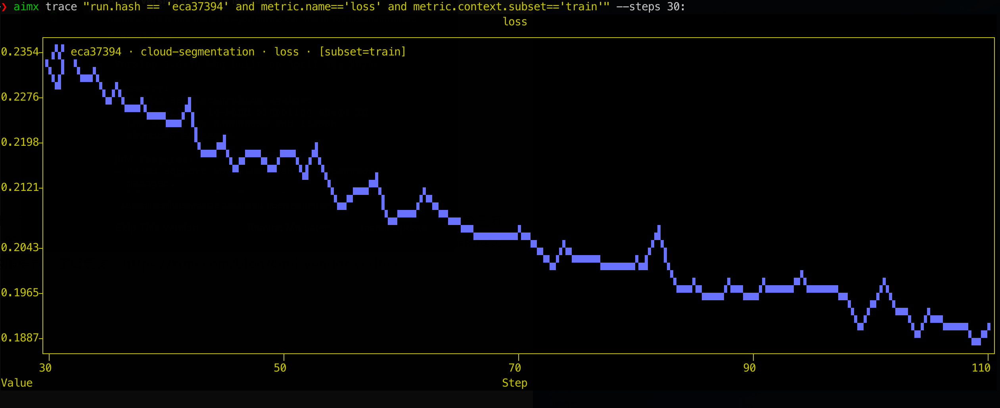
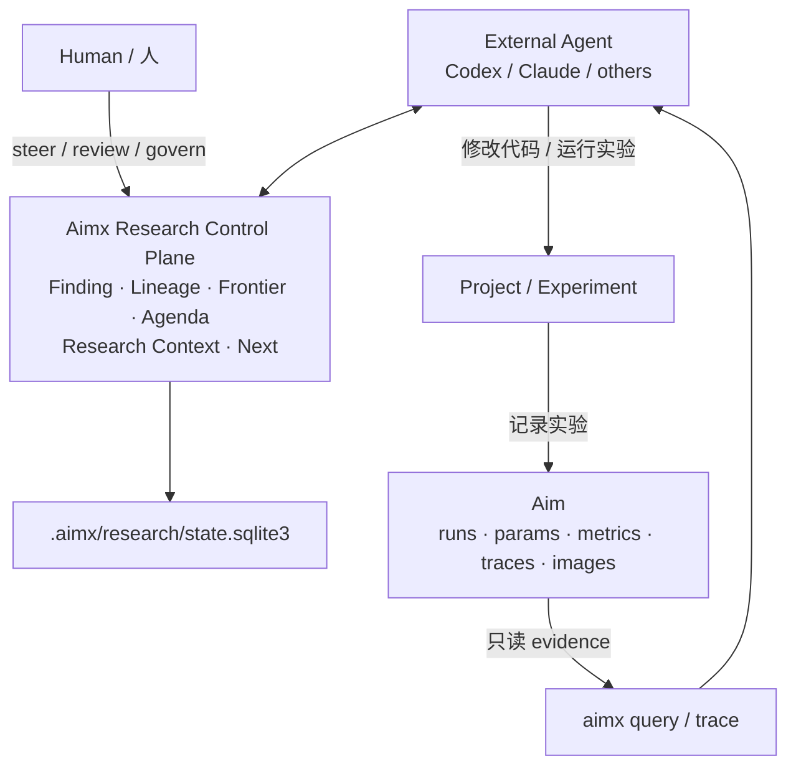
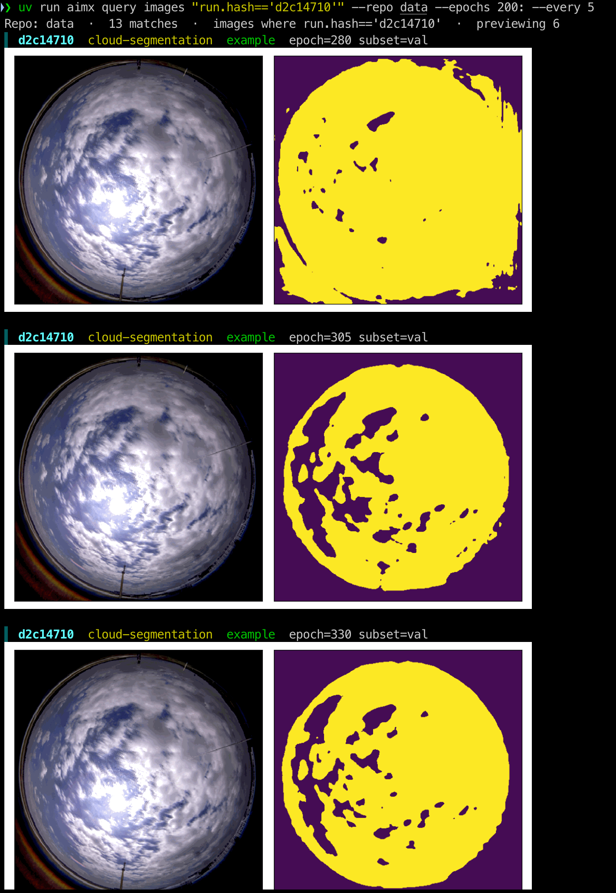
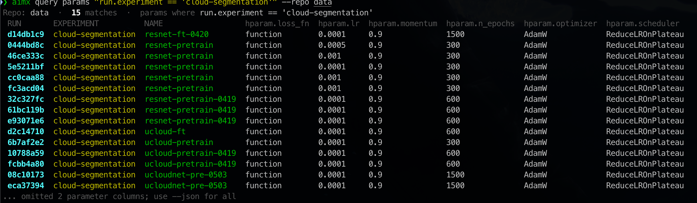
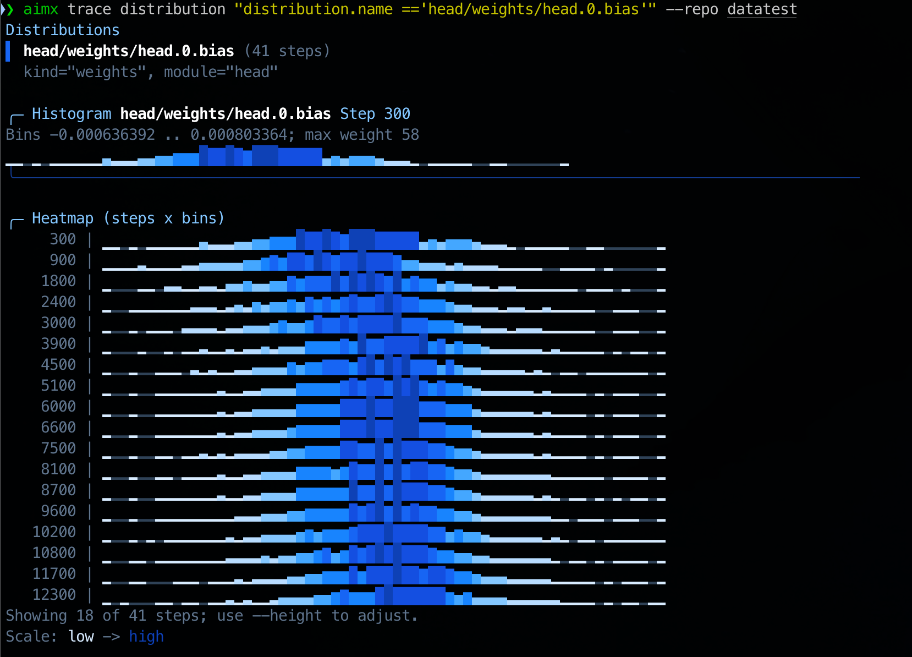

# aimx

**[English](./README.md) | 简体中文**



[](./LICENSE)
[](./pyproject.toml)
[](https://pypi.org/project/aimx/)
[](https://github.com/blizhan/aimx/actions/workflows/CI.yaml)
[](https://github.com/blizhan/aimx/actions/workflows/publish.yaml)

`aimx` 是原生 [Aim](https://github.com/aimhubio/aim) 的一个安全、增量、CLI-first 的伴生工具。

它补充了适合终端和 Agent 使用的实验查询、比较、预览、导出以及 AutoResearch
研究控制平面（Research Control Plane）能力。`aimx` 没有显式拥有的命令会继续委托给用户环境里的原生
[`aim`](https://github.com/aimhubio/aim) CLI。

## 快速开始

### 安装

```bash
# 安装到当前项目
uv add aimx

# 或使用 pip
pip install aimx
```

### 安装 Agent Skills

仓库包含面向 Aimx AutoResearch 的 Agent Skills：

```bash
npx skills install blizhan/aimx
```

安装后可以使用：

- `$aimx`：只读收集和分析实验参数、指标、曲线、图片以及研究状态（Research State）。
- `$aimx-hydra-lightning-builder`：Hydra + Lightning + Aim 脚手架和迁移审计工作流。

执行实验检查的环境中需要能够调用 `aimx` CLI。

### 检查环境

```bash
aimx --help
aimx version
aimx doctor
```

### 查询 Aim 仓库

如果当前目录就是 Aim repo 根目录，可以省略 `--repo`。显式提供时，`--repo`
既可以指向仓库根目录（如 `data`），也可以直接指向 `data/.aim`。

```bash
# 汇总所有 run 的指标
aimx query metrics --repo data

# 在支持的终端中预览图片
aimx query images --repo data

# 比较 run 参数和运行时长
aimx query params --repo data

# 绘制指标时间序列
aimx trace --repo data
```

## 特性

- **与原生 Aim 安全共存**：不替换 `aim` 可执行文件，也不修改已安装的 Aim 包。
- **明确的命令所有权**：Aimx 只接管自己实现的命令，其余命令原样委托给原生 Aim。
- **适合脚本和 Agent**：查询支持终端表格、纯文本、CSV/JSON 等机器可读输出。
- **终端图片预览**：支持的终端中可以直接查看 Aim image artifact，并有安全的文本 fallback。
- **指标追踪**：可绘图、表格、导出指标时间序列，并支持 step/epoch/sampling 过滤。
- **默认只读**：查询、检查、诊断和 passthrough 不修改 `.aim` 数据。
- **持久化 AutoResearch Research Control Plane**：研究结论（Finding）、结论谱系（Lineage）、人类干预、bounded context 和下一步实验契约保存在 Aimx 自己的 `.aimx/research` sidecar 中，Aim 继续作为证据源。

## AutoResearch：Research Control Plane

Aimx 的目标不是把 Agent、实验执行和实验数据库全部塞进同一个系统，而是提供一个
**可靠、结构化、可验证、可查询的 Research State API**，让不同 Agent 和人可以围绕同一份 Research State 协作。

职责被明确拆开：

- **Aim** 记录“发生了什么”：runs、params、metrics、traces、images、distributions。
- **Aimx Research State** 记录“我们学到了什么、接下来做什么”：Finding、Lineage、研究前沿（Frontier）、研究议程（Agenda）、研究上下文（Research Context）和 provenance。
- **外部 Agent**（Codex、Claude 等）负责推理、修改代码和运行实验；Aimx 不托管 Agent，也不负责调度训练。
- **人** 可以接受/拒绝 Finding、评论、调整 Frontier 或 Agenda，让干预成为持久状态，而不是只存在于某次 prompt 里。

> **Aim 存“发生了什么”；Aimx 存“我们学到了什么，以及下一步做什么”；Agent 负责决定和执行。**

### 架构



其中 `.aim` 始终是实验 evidence source。Research State 的读取不会初始化或修改 Aim，
显式研究写入只落到 Aimx 自己的：

```text
<repo>/.aimx/research/state.sqlite3
```

因此 Research State 可以独立删除、备份或交给另一个 Agent，而不会改变原始 Aim run 数据。

### 核心概念

| 概念 | 含义 |
| --- | --- |
| **Finding** | 从实验 evidence 中得到的持久化研究结论；claim 本身保持不可变，新的语义通过新 Finding 表达。 |
| **Lineage** | Finding 之间的关系，例如 `supports`、`challenges`、`refines`、`supersedes`。 |
| **Frontier** | 当前值得继续探索的研究方向、lane、优先级和状态，是人/Agent 共同维护的搜索策略。 |
| **Agenda** | 已经提出并持久化的 Experiment Contract；`research next` 只选择已有 Agenda，不自己发明实验。 |
| **Research Context** | 根据 objective 从完整历史中确定性编译出的 bounded shared memory。 |
| **研究更新（`ResearchUpdate`）** | 对 Research State 的一次原子更新，可以同时写 Finding、Lineage、annotation、Frontier 和 Agenda 状态。 |

### 一轮 AutoResearch 怎么运行

```text
research context
    ↓
research next / agenda
    ↓
Agent 推理 + 修改代码 + 执行实验
    ↓
Aim 记录 run / metric / trace / image
    ↓
aimx query / trace 读取 evidence
    ↓
Agent 解释实验结果
    ↓
research update
    ↓
Finding / Lineage / Frontier / Agenda 演化
    ↓
下一轮
```

最小工作流：

```bash
# 1. 查看当前 durable state
aimx research state --repo data --json

# 2. 给当前目标编译 bounded context
aimx research context --repo data \
  --objective "improve low-data accuracy" \
  --budget 12000 --json

# 3. 取已经持久化的下一项 Experiment Contract
aimx research next --repo data --json

# 4. Agent 在项目自己的工作流里修改代码、运行实验

# 5. 从 Aim 只读观察新结果
aimx query params --repo data --json
aimx query metrics "metric.name == 'accuracy'" --repo data --json
aimx trace "metric.name == 'accuracy'" --repo data --json --tail 100

# 6. Agent 生成 ResearchUpdate；先验证，再提交
aimx research update --repo data --file update.json --dry-run --json
aimx research update --repo data --file update.json --json
```

`--budget` 的单位是 **Research Context items 序列化后的精确 UTF-8 JSON 字节数**，
不是模型 token，也不是 AutoResearch 轮数。同一个 state、objective 和 budget 会得到确定性的上下文选择。

### 跨 Session / 跨 Agent 接力

Research State 的一个重要目标是让研究不依赖聊天记录：

```text
Codex Session A
      │
      │ ResearchUpdate
      ▼
.aimx/research/state.sqlite3
      │
      │ Research Context + Agenda
      ▼
Claude / Codex Session B
```

新的 Agent session 可以直接运行：

```bash
aimx research context --repo data --objective "..." --budget 12000 --json
aimx research next --repo data --json
```

它可以从 persisted Finding、Lineage、Frontier 和 Agenda 继续研究，而不需要把上一轮完整聊天重新塞进 prompt。

Research State 使用 optimistic revision。若另一个写入者已经推进 revision，旧
`base_revision` 的提交会返回 exit status `3` 和 `revision_conflict`。调用方需要重新读取
context 并重新判断，而不是静默重放旧决策。

完整协议见：

- [AutoResearch protocol](skills/aimx/references/autoresearch-protocol.md)
- [Research State quickstart](specs/007-research-state/quickstart.md)
- [Research State specification](specs/007-research-state/spec.md)

### Roadmap

#### Research Control Plane V1 — 已实现

- [x] Durable Finding、annotation、assessment 和 governance
- [x] Finding Lineage / typed relations
- [x] Atomic ResearchUpdate、revision conflict 和 idempotency
- [x] Deterministic bounded Research Context
- [x] 人/Agent 可共同干预的 Frontier
- [x] Durable Agenda / Experiment Contract 与 deterministic `research next`
- [x] 跨 session / 跨 Agent handoff
- [x] Aim evidence 只读集成
- [x] 两轮 AutoResearch protocol 和 agent-neutral JSON contract

#### 下一步方向

- [ ] Agent execution / orchestration adapters
- [ ] Experiment lifecycle adapters
- [ ] 更丰富的自动 Finding synthesis
- [ ] Research State 可视化与交互式探索
- [ ] 更长时间运行的 autonomous research loops

这些是发展方向，而不是兼容性承诺。Aimx 会继续保持 Research Control Plane 的边界，
避免变成隐式修改 Aim 的工具或通用实验调度平台。

## 命令

### Aimx 自己拥有的命令

| 命令 | 用途 |
| --- | --- |
| `aimx` / `aimx --help` / `aimx help` | 查看 CLI 帮助。 |
| `aimx version` | 查看 Aimx 版本和检测到的原生 Aim 版本。 |
| `aimx doctor` | 检查原生 Aim 和 passthrough 是否可用。 |
| `aimx query metrics` | 汇总匹配的指标序列。 |
| `aimx query images` | 查询并可选预览 image records。 |
| `aimx query params` | 比较 run-level 参数。 |
| `aimx trace` | 绘制、表格化或导出指标时间序列。 |
| `aimx research` | 读取/更新 Research State、Context、Agenda 和 Next。 |
| `aimx finding` | 查看、评论、评估和治理 Finding。 |
| `aimx lineage` | 查看和编辑 Finding 关系。 |
| `aimx frontier` | 查看和调整研究 Frontier。 |

`aimx query` 和 `aimx trace` 都接受可选的 **AimQL** 表达式。省略表达式时默认使用：

```text
run.hash != ''
```

例如：

```bash
aimx query metrics "metric.name == 'loss' and run.hparams.learning_rate > 0.001"
```

AimQL 语法见 [Aim Query language basics](https://aimstack.readthedocs.io/en/latest/using/search.html)。

### 查询指标

```bash
# rich terminal table
aimx query metrics --repo data

# AimQL 过滤
aimx query metrics "metric.name == 'loss'" --repo data

# short run hash 会自动展开
aimx query metrics "run.hash == 'eca37394' and metric.name == 'loss'" --repo data

# 脚本友好的输出
aimx query metrics "metric.name == 'loss'" --repo data --oneline
aimx query metrics "metric.name == 'loss'" --repo data --json

# step / epoch 窗口
aimx query metrics "metric.name == 'loss'" --repo data --steps 100:500
aimx query metrics "metric.name == 'loss'" --repo data --epochs 1:10

# sampling
aimx query metrics "metric.name == 'loss'" --repo data --head 20
aimx query metrics "metric.name == 'loss'" --repo data --tail 20
aimx query metrics "metric.name == 'loss'" --repo data --every 5
```

### 查询图片



```bash
# 支持图形协议的终端中 inline preview
aimx query images --repo data

# 只输出 metadata
aimx query images --repo data --plain
aimx query images --repo data --json

# 过滤和 sampling
aimx query images "images" --repo data --epochs 10:50 --head 10

# 控制 TTY preview 数量上限
aimx query images "images" --repo data --max-images 20
```

终端渲染由 [`textual-image`](https://github.com/lnqs/textual-image/tree/main#support-matrix-1)
提供。重定向 stdout 或使用 `--plain` / `--json` 可以关闭 inline rendering。

### 查询 run 参数



```bash
aimx query params --repo data

aimx query params "run.experiment == 'cloud-segmentation'" --repo data \
  --param hparam.lr \
  --param hparam.optimizer

aimx query params "run.experiment == 'cloud-segmentation'" --repo data --json
```

缺失的指定参数在终端/纯文本输出中显示为 `-`，JSON 中会列在 `missing_params`。
输出同时包含 run duration（如果可用）。

### Trace 指标

```bash
# 绘制匹配的 loss curve
aimx trace "metric.name == 'loss'" --repo data

# step-by-step table
aimx trace "metric.name == 'loss'" --repo data --table

# CSV / JSON
aimx trace "metric.name == 'loss'" --repo data --csv > loss.csv
aimx trace "metric.name == 'loss'" --repo data --json

# 过滤与 sampling
aimx trace "metric.name == 'loss'" --repo data --steps 100:500
aimx trace "metric.name == 'loss'" --repo data --tail 50
```

输出模式：默认 plot、`--table`、`--csv`、`--json`。
显示控制：`--width W`、`--height H`、`--no-color`。

### Trace distributions

`aimx trace distribution` 用于读取 Aim 中记录的 distribution sequence。
默认模式在终端中渲染当前 step histogram 与 step-by-bin heatmap；自动化场景使用
`--table`、`--csv` 或 `--json`。



```bash
aimx trace distribution --repo data

aimx trace distribution "distribution.name != ''" --repo data --step 12300

aimx trace distribution "distribution.name == 'weights'" --repo data --table
aimx trace distribution "distribution.name == 'weights'" --repo data --json
```

### 常用 query 选项

- 输出：`--json`、`--oneline` / `--plain`，或默认 rich terminal view。
- 过滤：支持处使用 `--steps start:end` 或 `--epochs start:end`。
- Sampling：`--head N`、`--tail N`、`--every K`。
- Images：`--max-images N` 控制 TTY preview 上限。
- Params：重复 `--param KEY` 选择参数列。
- Diagnostics：`--verbose` 输出更多诊断信息。

### 原生 Aim passthrough

Aimx 没有拥有的命令路径会委托给原生 `aim`：

```bash
aimx up
aimx init --help
aimx runs --help
aimx runs ls
```

## 文档

- [AutoResearch protocol](skills/aimx/references/autoresearch-protocol.md)：Agent-neutral AutoResearch handoff 协议。
- [Research State quickstart](specs/007-research-state/quickstart.md)：Research Control Plane 快速开始。
- [AimQL query language](https://aimstack.readthedocs.io/en/latest/using/search.html)：`query` / `trace` 过滤语法。
- [textual-image terminal support](https://github.com/lnqs/textual-image/tree/main#support-matrix-1)：inline image 支持矩阵。
- [CONSTITUTION.md](./CONSTITUTION.md)：项目安全、范围与兼容性原则。
- [specs/](./specs)：已实现功能的 spec、plan、contract 和 quickstart。
- [TODO.md](./TODO.md)：早期 roadmap notes。

## Runtime Contract

- `aimx` 不替换 `aim` 可执行文件。
- `aimx` 不修改已安装的 `aim` 包。
- help、version、doctor、query、trace 和 passthrough 不修改 `.aim` 数据。
- Research State 读取同样不会修改 `.aim`；显式 ResearchUpdate 只写 `.aimx/research`。
- 委托给原生 Aim 的命令仍要求环境里存在原生 Aim runtime。

## 开发

项目本地开发使用 Python 3.12，runtime 支持 `>=3.10,<3.13`。

```bash
uv python install 3.12
uv venv --python 3.12
uv sync --group dev
uv run pytest
```

常用本地检查：

```bash
uv run aimx --help
uv run aimx version
uv run aimx doctor
uv run aimx query metrics --repo data
uv run aimx query images --repo data/.aim --json
uv run aimx query params --repo data --json
uv run aimx research state --repo data --json
```
